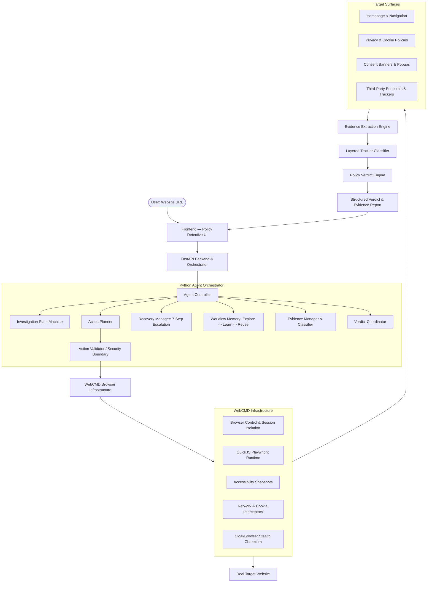

# Policy Detective — System Architecture

Policy Detective is an agentic web investigation system that reads a website's policies, converts disclosures into testable claims, uses WebCMD to investigate the real website, collects browser/network evidence, compares stated policy against observed behavior, and produces an evidence-backed verdict.

---

## 1. User & Application Layer (Frontend)
- **Framework**: React 19 + TypeScript + Vite + Tailwind CSS v4.
- **Design Philosophy**: Sleek dark aesthetic, high contrast, non-accusatory evidence presentation, real-time telemetry streaming via Server-Sent Events (SSE).
- **Core Views**:
  - **Landing Page**: Fast URL entry, verified presets, architecture breakdown, security disclaimer.
  - **Live Investigation Page**: Real-time progress bar, stage stepper (Discovery → Extraction → Pre-Consent → Accept-All → Reject-All → Analysis → Verdicts), auto-scrolling telemetry terminal.
  - **Report Dashboard**: Scorecard summary, finding cards with confidence rating, 3-state experiment comparison matrix, filterable technical evidence explorer, full policy reader.

---

## 2. Agent & Reasoning Layer (Backend)
- **Framework**: Python 3.14 + FastAPI + SQLAlchemy Async ORM + SQLite / PostgreSQL.
- **Agent Controller (`backend/agent/controller.py`)**: Master state machine coordinating the complete exploration lifecycle.
- **Action Validator (`backend/agent/validator.py`)**: Strict allowlist security boundary. Validates all proposed URLs and actions before execution (blocks SSRF, private IPs, unsafe schemes).
- **Recovery Manager (`backend/agent/recovery.py`)**: 7-step ordered recovery pipeline:
  1. *Retry* (transient errors)
  2. *Browser Escalation* (when raw HTTP fetch is bot-blocked)
  3. *Site Search* (when policy pages are unlinked)
  4. *Related Links* (fallback navigation)
  5. *Document / PDF* (unstructured content)
  6. *Re-plan* (adaptive prompt restructuring)
  7. *Unable to Verify* (fail-safe without fabrication)
- **Workflow Memory (`backend/agent/workflow_memory.py`)**: Implements Explore → Learn → Reuse loop with database persistence and WebCMD sitemap integration.

---

## 3. WebCMD Infrastructure Layer (`backend/webcmd/adapter.py`)
- **Single Point of Integration**: All CLI interactions route strictly through `WebCMDAdapter`.
- **Session Isolation**: Each experiment runs in an independent browser workspace (`webcmd session create -f json`).
- **Stealth Automation**: Driven by CloakBrowser Chromium (v146.0.7680.177.5).
- **Sandboxed Execution**: Playwright scripts execute in QuickJS sandboxes with DOM isolation.
- **Deterministic Capture**: Attaches `page.on('request')` and `page.on('response')` before navigation.

---

## 4. Evidence Extraction & Decision Layer
- **Layered Classification (`backend/evidence/classifier.py`)**:
  - *Layer 1*: 100+ known ad, analytics, social, payment, CDN domain fingerprints.
  - *Layer 2*: First-party vs. third-party hostname boundary matching.
  - *Layer 3*: URL path and cookie name heuristic patterns.
  - *Layer 4*: LLM escalation for ambiguous signatures.
- **Verdict Engine (`backend/verdict/engine.py`)**:
  - Deterministically evaluates cookie deltas across Pre-consent, Accept, and Reject states.
  - Calculates evidence volume and coverage confidence scores.
  - Formulates non-accusatory findings (*CONSISTENT*, *POTENTIAL_INCONSISTENCY*, *STRONG_INCONSISTENCY*, *UNABLE_TO_VERIFY*).
